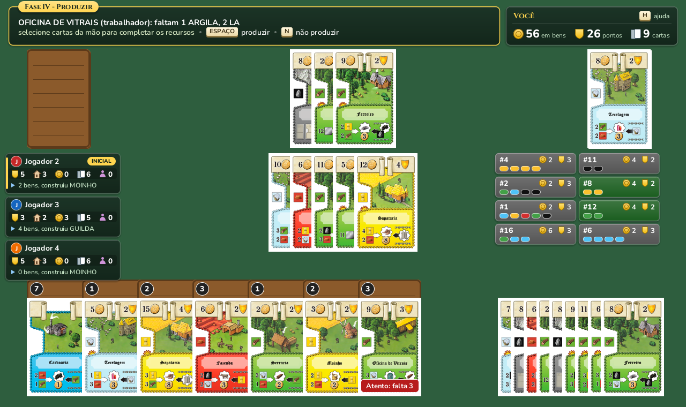
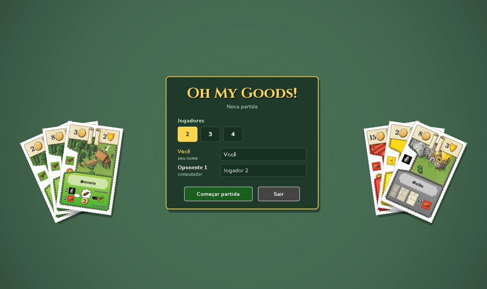
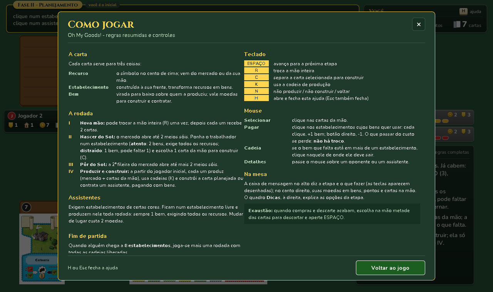

# JOhMyGoods

Versão digital do jogo de cartas **Oh My Goods!** (Alexander Pfister), feita em Java com Swing. Partida completa de 2 a 4 jogadores: você contra oponentes controlados pelo computador.

> Projeto de estudo, sem fins comerciais. *Oh My Goods!* © 2016 Lookout Spiele / Mayfair Games; versão brasileira © 2019 PaperGames.



## Telas

| Tela inicial | Ajuda (tecla `H`) |
|---|---|
|  |  |

## Como executar

Requisitos: **JDK 21+** (o JDK 25 também funciona). O Maven não precisa estar instalado, porque o projeto traz o wrapper `mvnw`.

```bash
./mvnw package
java -jar target/OhMyGoods.jar
```

O `.jar` já inclui o banco de cartas (SQLite), as imagens e o driver. Também dá para rodar direto com `./mvnw exec:java` ou pela classe `org.cardGames.Main` no IntelliJ IDEA. Para Windows há um instalador em [docs/OhMyGoods_v01.msi](docs/OhMyGoods_v01.msi).

## Regras do jogo

Cada jogador administra uma pequena cadeia produtiva. Toda carta serve para três coisas:

- **Recurso:** o símbolo no canto esquerdo da carta. Vem do mercado ou da sua mão.
- **Estabelecimento:** construído à sua frente, transforma recursos em bens.
- **Bem:** carta virada sobre o estabelecimento que a produziu. Vale moedas para construir e contratar.

Cada um começa com uma **Carvoaria**, 7 carvões sobre ela, 5 cartas na mão e um trabalhador.

### A rodada

1. **Nova mão:** você pode trocar a mão inteira (uma vez). Depois, cada jogador recebe 2 cartas.
2. **Nascer do Sol:** cartas são abertas no mercado até aparecerem 2 meios sóis. Coloque o trabalhador num estabelecimento:
   - **atento:** exige todos os recursos e produz 2 bens;
   - **distraído:** pode faltar 1 recurso e produz 1 bem.

   Separe também, se quiser, uma carta da mão para construir.
3. **Pôr do Sol:** uma segunda fileira do mercado abre, até aparecerem mais 2 meios sóis.
4. **Produzir e construir:** a partir do jogador inicial, cada um produz usando o mercado (compartilhado; os recursos não saem de lá) e cartas da mão para completar o que falta. Um estabelecimento que produziu pode usar sua **cadeia de produção** quantas vezes quiser, transformando cartas da mão ou bens já produzidos em mais bens. Depois, constrói a carta separada **ou** contrata um assistente, pagando com bens. Não há troco.

No fim da rodada, o mercado é descartado e o jogador seguinte vira o inicial.

### Assistentes

Para contratar um assistente, você precisa ter estabelecimentos nas cores e quantidades exigidas e pagar o custo. Ele fica num estabelecimento livre e produz ali toda rodada: sempre 1 bem, exigindo todos os recursos. Mudar de lugar custa 2 moedas.

### Fim da partida

Quando alguém chega a **8 estabelecimentos**, termina a rodada atual e joga-se mais uma, com as cadeias de **todos** os estabelecimentos liberadas. Os pontos vêm de três fontes:

- pontos dos estabelecimentos;
- pontos dos assistentes;
- 1 ponto a cada 5 moedas em bens que sobraram.

Vence quem tiver mais pontos. No empate, vence quem tiver mais moedas restantes.

As regras completas estão no [manual](docs/oh_my_goods_manual.md).

## Controles

| Tecla | Ação |
|---|---|
| `ESPAÇO` | Avança para a próxima etapa |
| `R` | Fase I: troca a mão inteira |
| `C` | Planejamento: separa a carta selecionada para construir |
| `K` | Usa a cadeia de produção |
| `N` | Não produzir / não construir / voltar |
| `H` | Abre e fecha a ajuda |

Com o mouse, clique nas cartas da mão para selecioná-las e nos estabelecimentos para alocar o trabalhador e os assistentes ou para pagar com seus bens (o botão direito tira um bem). Passe o mouse sobre um oponente ou um assistente para ver os detalhes.

## Tecnologias e estrutura

Java 21, Swing, SQLite (`sqlite-jdbc`) e Maven. O código é dividido em três camadas:

- **Modelo:** `Card`, `Deck`, `Player`, `Building`, `Assistant`, `Worker`, `Market`, `Resource`, `GameState`
- **Regras:** `Game`, `Production`, `Bot`, `Scoring`, `Setup` (independentes da interface e cobertas por testes)
- **Interface:** `MainWindow`, `StartScreen`, `TablePanel`, `HelpOverlay`, `CardSprite`, `Zone`

A classe de teste `org.cardGames.Snapshots` joga partidas pela interface sem abrir janela e salva capturas de tela em PNG, inclusive as deste README.

## Documentação

- [Planejamento por fases](docs/PLANEJAMENTO.md)
- [Manual do jogo (PDF)](docs/oh_my_goods_manual.pdf)
- [Documentação técnica (DOCX)](docs/Documentação%20Técnica%20-%20JOhMyGoods.docx)
